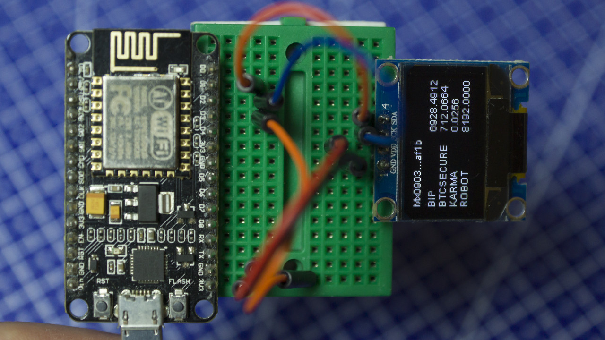

# Minter wallet Arduino



### Требуемые библиотеки
Часть доступна через менеджер библиотек. Так же необходимо [установить поддержку ESP8266](https://github.com/esp8266/Arduino "установить поддержку ESP8266")
* [WiFiManager](https://github.com/tzapu/WiFiManager)
* [ESP8266WiFi](https://github.com/esp8266/Arduino)
* [SSD1306Wire](https://github.com/ThingPulse/esp8266-oled-ssd1306)
* [QList](https://github.com/SloCompTech/QList)

### Как пользоваться:
* нажать кнопку (схема будет)
* подключиться к WiFi точке `OnDemandAP`
* Зайти на `http://192.168.4.1` и интуитивно добавить точку доступа

### Немного кода

```arduino
Wallet wallet;
if (minterApi.getAddress("Mx1234....4242", 0, wallet) == MINTERAPI_OK){
        Serial << prefix << "Wallet: " << wallet.address << ", count_txs: " << wallet.count_txs << ", length: " << wallet.balance.length() << endl;
for (uint16_t i = 0; i < balance.length(); i++)
    {
        Serial << "coin: " << balance.at(i).coin << ", amount: " << balance.at(i).amount << ", amountStr: " << balance.at(i).amountStr << endl;
    }
}
```

### TODO list
* Добавление API и адреса API в конфигуратор
* Добавление схемы